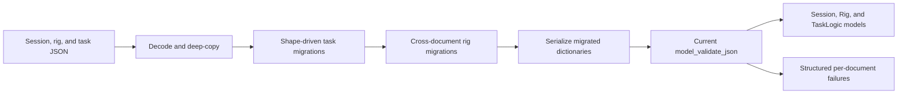

# VR Foraging schema migrations

The schema migration layer converts historical session, rig, and task-logic JSON
documents into the three model classes installed with this package. It is
intended for reading historical acquisition metadata, not rewriting operational
rig configurations for future experiments.

See [Caveats and review notes](schema-migration-notes.md) for transformations
that are lossy, inferred, or require human interpretation.

## Update process



`schema_harmonizer` is the public triplet operation. The Parquet harness calls
it by default for every row and keeps processing after failures. Inputs are
deep-copied before migration and are never modified.

For large validation runs, pass `retain_rows=False`. The harness then retains
failure details and the success count without holding thousands of complete
Pydantic model triplets in memory. The default remains `True` when callers need
the successfully harmonized models.

The process is deliberately shape-driven. The dataset release selects broad
families, but each document is migrated from the fields it actually contains.
This matters for release candidates and for the observed row whose rig and task
carry different internal release versions.

## Migration families

| Source shape | Transformation |
| --- | --- |
| Current 1.x | No JSON migration; validate directly. |
| 0.5-0.6 rigs | Apply the upgrade pattern from VR Foraging issue 499: flatten calibration `input`/`output`, normalize device discriminators, and add `data_directory` from `session.root_path`. |
| Pre-0.5 rigs | Additionally group individual cameras into controllers, convert the legacy treadmill shape, remove the clock-repeater field, and construct required modern device shells. |
| Flat 0.3 task logic | Move task fields under `task_parameters`, create a one-block environment, and unwrap matrix `{data: ...}` containers. |
| Legacy reward functions | Convert the old single patch function into entry initialization plus rule-driven updates. Constant, linear, power, and lookup-table functions preserve their mathematical behavior. |
| Legacy updaters | Convert `OffsetPercentage` to the equivalent multiplicative `Gain`, using `1 + update`. |
| Legacy discriminators | Normalize screen, Harp device, and reward-function type names. |

The final step always serializes the migrated dictionaries and invokes:

```python
Session.model_validate_json(...)
AindVrForagingRig.model_validate_json(...)
AindVrForagingTaskLogic.model_validate_json(...)
```

A successful result therefore means all three outputs satisfy the current
formal schemas; it does not merely mean that migration code ran without an
exception.

## Semantic compatibility decisions

Most migrations are lossless moves or discriminator renames. These cases need
special attention during review:

- Historical rigs before camera controllers are grouped without changing
  camera identity or acquisition settings.
- The legacy treadmill used a Behavior board. The current schema only accepts a
  Harp Treadmill, so the migration preserves its port, serial number, and wheel
  calibration while assigning the current treadmill device identity.
- Pre-0.4 rigs have no manipulator document. A required current manipulator
  shell is created with model defaults and an empty port.
- Missing old olfactometer calibration is reconstructed from task patch labels.
  Odor names and channel indices are retained; unknown dilution is represented
  as `null`, and channel 3 is the required carrier.
- Sixteen observed 0.5.1 task documents specify a 10,000 Hz cue, while the
  current model has a hard maximum of 9,999 Hz. The migration uses 9,999 Hz.
- A legacy power reward function with a non-zero additive offset cannot be
  represented by the current multiplicative updater. Such an unseen document
  raises an error rather than silently changing its behavior.

Historical FFmpeg arguments are retained. Issue 499 replaced them to prepare
rigs for future acquisition, but changing them here would misrepresent how an
already completed session was recorded.
